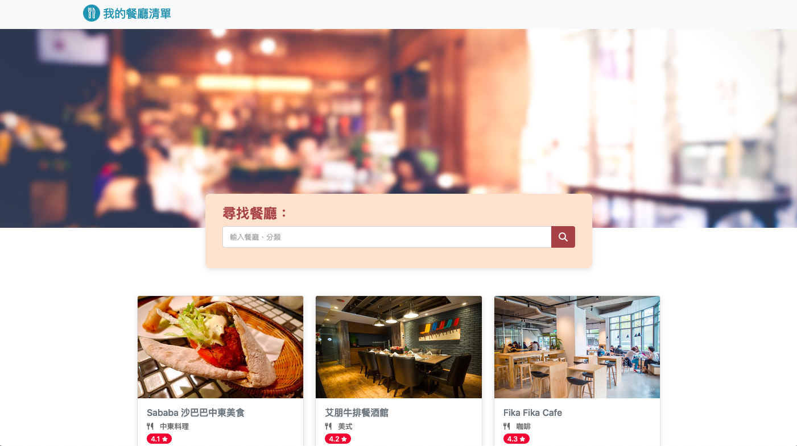
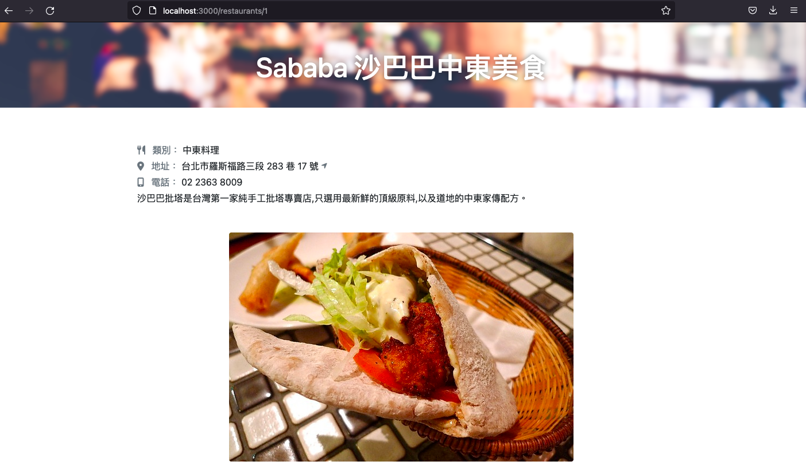

# 我的餐廳清單
此專案使用 Node.js 與 Express.js 打造，提供使用者尋找喜愛的餐廳。
</br>
</br>

## 專案畫面
首頁

</br>
</br>
餐廳資訊頁面

</br>
</br>

## Features - 功能
- 透過點擊可觀看餐廳詳細資訊。
- 透過餐廳名字、類別找出合適的餐廳資訊。
</br>
</br>

## 環境建置
- express: 4.16.4
- express-handlebars: 3.0.0
- nodemon: 2.0.20
</br>
</br>

## Installing - 專案安裝流程
1. 打開終端機，下載此專案。

```
git clone https://github.com/JamieLoLo/restaurant-list.git
```
2. 進入專案資料夾
```
cd restaurant-list
```
3. 安裝套件
```
npm install
```
4. 執行 nodemon
```
nodemon app.js
```
5. 終端機顯示以下字串即代表成功連結
```
Server is listening on localhost:3000
```
6. 打開瀏覽器，輸入localhost:3000。
</br>
</br>

## 專案開發人員
<a href="https://github.com/JamieLoLo">Jamie Lo</a>
